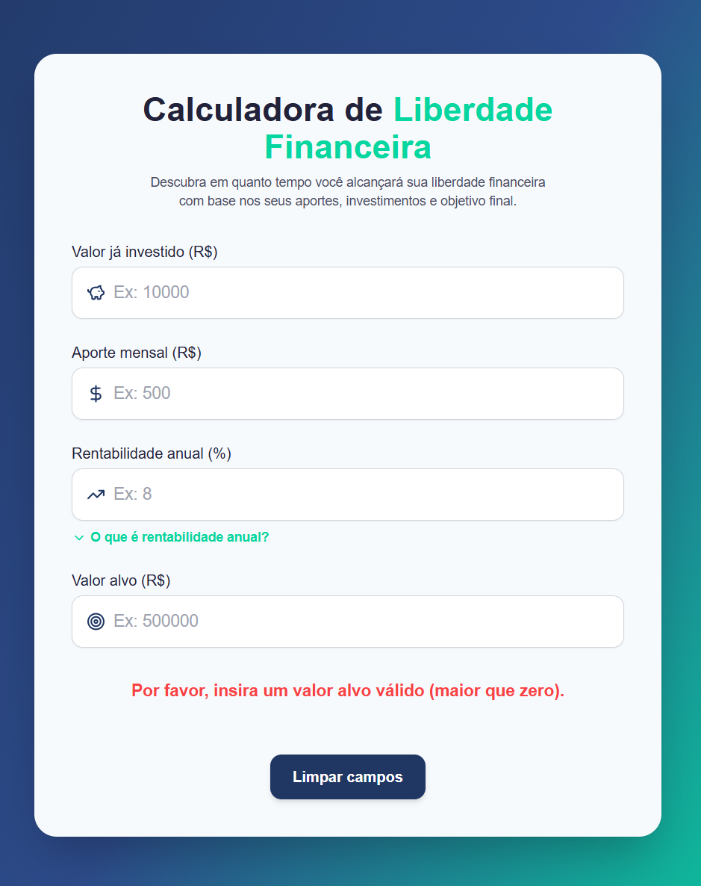

# Calculadora de Liberdade Financeira

Uma calculadora bonita e interativa construída com **React**, **TypeScript** e **Tailwind CSS** para ajudar você a estimar em quanto tempo poderá alcançar seus objetivos de liberdade financeira. Insira o valor já investido, aporte mensal, rentabilidade anual esperada e valor alvo — veja instantaneamente a projeção em anos e meses!

## ✨ Funcionalidades

- **UI Moderna:** Design limpo e responsivo usando Tailwind CSS.
- **Animações:** Transições suaves e informações extras utilizando Framer Motion.
- **Componentização:** Componentes React reutilizáveis e bem organizados.
- **Interatividade:** Campos editáveis com validação e dicas informativas.
- **Lógica de Cálculo:** Estima o tempo para o objetivo usando juros compostos e aportes regulares.

## 🚀 Como começar

### 1. Clone o repositório

```bash
git clone https://github.com/Marcelosoaresdev/Calculadora-de-Liberdade-Financeira
cd calculadora-liberdade-financeira
```

### 2. Instale as dependências

```bash
npm install
# ou
yarn
```

### 3. Rode o servidor de desenvolvimento

```bash
npm run dev
# ou
yarn dev
```

Abra [http://localhost:5173](http://localhost:5173) (ou a porta exibida no terminal) para ver o app funcionando.

## 🛠️ Tecnologias

- [React](https://react.dev/)
- [TypeScript](https://www.typescriptlang.org/)
- [Tailwind CSS](https://tailwindcss.com/)
- [Framer Motion](https://www.framer.com/motion/)
- [Lucide Icons](https://lucide.dev/)

## 📁 Estrutura do Projeto

```
src/
  components/
    Heading.tsx
    InvestmentInput.tsx
    RendimentoInfo.tsx
    Result.tsx
    ResetButton.tsx
  App.tsx
  index.css
  main.tsx
tailwind.config.js
```

## 🧮 Como funciona

1. **Entradas:** Informe o valor já investido, aporte mensal, rentabilidade anual esperada e objetivo financeiro.
2. **Cálculo:** O app calcula, usando juros compostos, quantos meses (e anos) serão necessários para atingir o objetivo.
3. **Resultado:** Veja instantaneamente o tempo estimado ou mensagens de aviso se o objetivo for inalcançável com os valores atuais.

## 📸 Screenshots



## 📝 Licença

Este projeto é open-source e está disponível sob a [Licença MIT](LICENSE).

---

Feito com ❤️ por [Marcelo Soares] https://github.com/marcelosoaresdev
